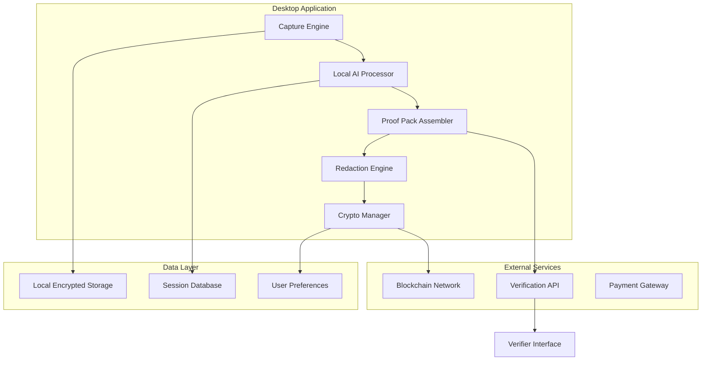
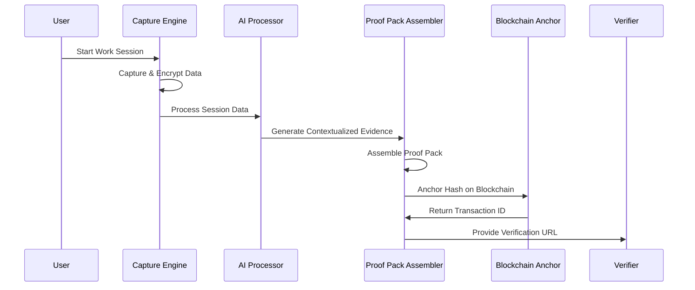

# Design Document

## Overview

Notari is a desktop application that provides cryptographically secure proof-of-work verification through tamper-evident session capture, AI-powered analysis, and blockchain anchoring. The system uses a multi-layered security approach combining local encryption, cryptographic signatures, and distributed ledger technology to create immutable evidence of human work processes.

The architecture follows a modular design with clear separation between capture, processing, packaging, and verification components. This enables independent development, testing, and future extensibility while maintaining security boundaries.

## Architecture

### High-Level System Architecture



### Security Architecture

The system implements defense-in-depth security with multiple layers:

1. **Device-Level Security**: Hardware-backed key generation and secure enclaves where available
2. **Application-Level Security**: End-to-end encryption with rotating keys
3. **Network-Level Security**: TLS 1.3 for all external communications
4. **Blockchain-Level Security**: Immutable anchoring with Merkle tree verification

### Data Flow Architecture



## Components and Interfaces

### 1. Capture Engine

**Purpose**: Securely capture user work sessions with tamper-evident timestamps.

**Key Components**:
- **Screen Capture Module**: Cross-platform screen recording using native APIs
- **Input Monitor**: Keyboard and mouse event capture with privacy filtering
- **Timestamp Service**: High-resolution timing with cryptographic signatures
- **Encryption Layer**: Real-time AES-256-GCM encryption of captured data

**Platform-Specific Implementation**:
- **Windows**: DirectX/Windows Graphics Capture API for screen, Windows Input API for events
- **macOS**: AVFoundation for screen capture, CGEvent API for input monitoring

**Interfaces**:
```typescript
interface CaptureEngine {
  startSession(config: SessionConfig): Promise<SessionId>
  stopSession(sessionId: SessionId): Promise<EncryptedSessionData>
  pauseSession(sessionId: SessionId): Promise<void>
  resumeSession(sessionId: SessionId): Promise<void>
  getSessionStatus(sessionId: SessionId): SessionStatus
}

interface SessionConfig {
  captureScreen: boolean
  captureKeystrokes: boolean
  captureMouse: boolean
  privacyFilters: PrivacyFilter[]
  qualitySettings: CaptureQuality
}
```

### 2. Local AI Processor

**Purpose**: Analyze captured sessions to provide context and detect AI-generated content indicators.

**Key Components**:
- **Content Analyzer**: Processes text, images, and behavioral patterns
- **Pattern Recognition**: Identifies typing patterns, work rhythms, and content creation flows
- **Summarization Engine**: Generates concise summaries of work activities
- **Anomaly Detection**: Flags potential AI-generated content or suspicious patterns

**AI Model Strategy**:
- Local inference using quantized models (ONNX Runtime)
- Fallback to cloud APIs for complex analysis (with user consent)
- Continuous learning from user feedback on accuracy

**Interfaces**:
```typescript
interface AIProcessor {
  analyzeSession(sessionData: EncryptedSessionData): Promise<AIAnalysis>
  generateSummary(analysis: AIAnalysis): Promise<WorkSummary>
  detectAnomalies(sessionData: EncryptedSessionData): Promise<AnomalyReport>
  updateModels(): Promise<void>
}

interface AIAnalysis {
  contentType: ContentType
  workPatterns: WorkPattern[]
  confidenceScore: number
  relevanceScores: RelevanceScore[]
  potentialFlags: AnomalyFlag[]
}
```

### 3. Proof Pack Assembler

**Purpose**: Bundle session data, AI analysis, and metadata into verifiable packages.

**Key Components**:
- **Data Aggregator**: Combines multiple sessions and analysis results
- **Format Generator**: Creates JSON and PDF outputs with embedded verification data
- **Metadata Manager**: Handles timestamps, user information, and system context
- **Hash Generator**: Creates cryptographic fingerprints for integrity verification

**Proof Pack Structure**:
```json
{
  "proofPackId": "uuid",
  "version": "1.0",
  "metadata": {
    "creator": "user_id",
    "created": "timestamp",
    "sessions": ["session_ids"],
    "totalDuration": "milliseconds"
  },
  "evidence": {
    "sessions": [/* encrypted session data */],
    "aiAnalysis": [/* AI insights */],
    "timeline": [/* chronological events */]
  },
  "verification": {
    "signatures": [/* cryptographic signatures */],
    "merkleRoot": "hash",
    "blockchainAnchor": "transaction_id"
  }
}
```

**Interfaces**:
```typescript
interface ProofPackAssembler {
  createProofPack(sessions: SessionId[], config: PackConfig): Promise<ProofPack>
  exportToPDF(proofPack: ProofPack): Promise<Buffer>
  exportToJSON(proofPack: ProofPack): Promise<string>
  validateIntegrity(proofPack: ProofPack): Promise<ValidationResult>
}
```

### 4. Redaction Engine

**Purpose**: Enable selective privacy controls while maintaining verification integrity.

**Key Components**:
- **Content Selector**: UI for marking sensitive areas in captured content
- **Cryptographic Redaction**: Zero-knowledge proofs for redacted areas
- **Integrity Preservation**: Maintains verification capability for non-redacted content
- **Redaction Audit**: Tracks what was redacted and when

**Redaction Strategy**:
- Use commitment schemes to prove redacted content existed
- Maintain separate hashes for redacted and non-redacted portions
- Enable partial verification without revealing redacted information

**Interfaces**:
```typescript
interface RedactionEngine {
  markForRedaction(proofPack: ProofPack, areas: RedactionArea[]): Promise<RedactionPlan>
  applyRedactions(plan: RedactionPlan): Promise<RedactedProofPack>
  verifyRedactedPack(pack: RedactedProofPack): Promise<PartialVerificationResult>
  generateRedactionProof(areas: RedactionArea[]): Promise<RedactionProof>
}
```

### 5. Blockchain Anchor Service

**Purpose**: Provide immutable timestamping and verification through blockchain technology.

**Key Components**:
- **Blockchain Adapter**: Abstraction layer supporting multiple blockchain networks
- **Transaction Manager**: Handles blockchain transactions with retry logic
- **Merkle Tree Generator**: Creates efficient verification proofs
- **Anchor Verification**: Validates blockchain anchors and generates proofs

**Blockchain Strategy**:
- Primary: Arweave for permanent storage and low costs
- Secondary: Ethereum for high-value proofs requiring maximum security
- Adapter pattern enables easy addition of new blockchain networks

**Interfaces**:
```typescript
interface BlockchainAnchor {
  anchorHash(hash: string, metadata: AnchorMetadata): Promise<AnchorResult>
  verifyAnchor(anchorId: string): Promise<AnchorVerification>
  generateMerkleProof(hash: string, anchorId: string): Promise<MerkleProof>
  getSupportedNetworks(): BlockchainNetwork[]
}

interface AnchorResult {
  transactionId: string
  blockNumber: number
  timestamp: number
  networkId: string
  cost: number
}
```

### 6. Verification API

**Purpose**: Enable independent verification of Proof Packs by third parties.

**Key Components**:
- **REST API Server**: Public endpoints for verification requests
- **Verification Engine**: Core logic for validating Proof Pack integrity
- **Rate Limiting**: Prevents abuse while ensuring availability
- **Analytics**: Tracks verification requests and success rates

**API Endpoints**:
```
POST /api/v1/verify
GET /api/v1/verify/{verificationId}
GET /api/v1/proof-pack/{proofPackId}/status
POST /api/v1/verify/batch
```

**Interfaces**:
```typescript
interface VerificationAPI {
  verifyProofPack(proofPack: ProofPack): Promise<VerificationResult>
  getVerificationStatus(verificationId: string): Promise<VerificationStatus>
  batchVerify(proofPacks: ProofPack[]): Promise<BatchVerificationResult>
  generateVerificationReport(result: VerificationResult): Promise<VerificationReport>
}
```

## Data Models

### Core Data Models

```typescript
// Session Management
interface WorkSession {
  id: SessionId
  userId: string
  startTime: timestamp
  endTime?: timestamp
  status: 'active' | 'paused' | 'completed' | 'failed'
  captureConfig: SessionConfig
  encryptedData: EncryptedBlob
  checksums: string[]
}

// AI Analysis Results
interface WorkPattern {
  type: 'typing' | 'mouse' | 'application' | 'content'
  confidence: number
  timeRange: TimeRange
  characteristics: Record<string, any>
}

interface AnomalyFlag {
  type: 'ai_generated' | 'copy_paste' | 'unusual_pattern'
  severity: 'low' | 'medium' | 'high'
  evidence: string[]
  confidence: number
}

// Proof Pack Structure
interface ProofPack {
  id: string
  version: string
  metadata: ProofPackMetadata
  evidence: Evidence
  verification: VerificationData
  redactions?: RedactionData
}

// Blockchain Integration
interface BlockchainAnchor {
  network: string
  transactionId: string
  blockNumber: number
  timestamp: number
  merkleRoot: string
  cost: number
}

// User Management
interface User {
  id: string
  email: string
  subscription: SubscriptionTier
  deviceKeys: DeviceKey[]
  preferences: UserPreferences
  organizationId?: string
}
```

### Database Schema

The system uses SQLite for local storage with the following key tables:

- **sessions**: Work session metadata and references to encrypted files
- **proof_packs**: Proof Pack metadata and status
- **blockchain_anchors**: Blockchain transaction records
- **redactions**: Redaction history and proofs
- **user_preferences**: Application settings and configurations

## Error Handling

### Error Categories and Strategies

1. **Capture Errors**
   - Hardware failures: Graceful degradation with user notification
   - Permission issues: Clear guidance for granting required permissions
   - Storage errors: Automatic retry with exponential backoff

2. **Processing Errors**
   - AI model failures: Fallback to simpler analysis or manual annotation
   - Encryption errors: Immediate session termination with data preservation
   - Network errors: Queue operations for retry when connectivity returns

3. **Blockchain Errors**
   - Transaction failures: Automatic retry with fee adjustment
   - Network congestion: Queue anchoring with user notification
   - Verification failures: Detailed error reporting with remediation steps

4. **Verification Errors**
   - Integrity failures: Clear indication of what failed verification
   - Missing anchors: Guidance for re-anchoring if possible
   - Expired certificates: Automatic renewal where possible

### Error Recovery Mechanisms

```typescript
interface ErrorHandler {
  handleCaptureError(error: CaptureError): Promise<RecoveryAction>
  handleProcessingError(error: ProcessingError): Promise<RecoveryAction>
  handleBlockchainError(error: BlockchainError): Promise<RecoveryAction>
  handleVerificationError(error: VerificationError): Promise<RecoveryAction>
}

enum RecoveryAction {
  RETRY = 'retry',
  FALLBACK = 'fallback',
  USER_INTERVENTION = 'user_intervention',
  ABORT = 'abort'
}
```

## Testing Strategy

### Unit Testing
- **Coverage Target**: 90% code coverage for core components
- **Framework**: Jest for TypeScript/JavaScript components
- **Mocking**: Mock external services (blockchain, AI APIs) for isolated testing
- **Cryptographic Testing**: Dedicated tests for all cryptographic operations

### Integration Testing
- **Cross-Platform Testing**: Automated testing on Windows and macOS
- **Blockchain Integration**: Test against blockchain testnets
- **End-to-End Workflows**: Complete user journeys from capture to verification
- **Performance Testing**: Session capture performance under various loads

### Security Testing
- **Penetration Testing**: Regular security audits of cryptographic implementations
- **Fuzzing**: Input validation testing for all user-facing interfaces
- **Key Management Testing**: Comprehensive testing of key lifecycle operations
- **Privacy Testing**: Verification that redacted content cannot be recovered

### User Acceptance Testing
- **Persona-Based Testing**: Testing with actual students, professionals, and verifiers
- **Usability Testing**: Interface testing with target user groups
- **Performance Benchmarking**: Real-world performance validation
- **Compatibility Testing**: Testing across different hardware configurations

### Continuous Integration
- **Automated Testing**: All tests run on every commit
- **Security Scanning**: Automated vulnerability scanning
- **Performance Monitoring**: Continuous performance regression testing
- **Cross-Platform Builds**: Automated builds for all supported platforms