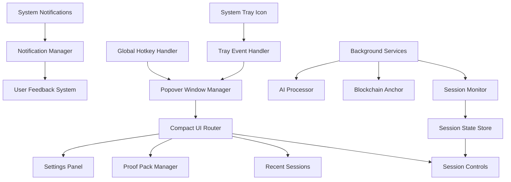

# Design Document

## Overview

This design document outlines the transformation of Notari from a traditional desktop application with a main window to a system tray-based application with a compact popover interface. The new architecture will provide a more streamlined user experience that aligns with Notari's role as a background monitoring tool.

The design leverages Tauri's native tray capabilities and window management APIs to create a responsive, efficient, and user-friendly interface that minimizes desktop clutter while maximizing accessibility.

## Architecture

### High-Level Architecture



### Component Hierarchy

The tray-based UI will consist of several key architectural layers:

1. **Tray Management Layer**: Handles system tray icon, events, and lifecycle
2. **Window Management Layer**: Controls popover window creation, positioning, and state
3. **UI Router Layer**: Manages navigation between different views within the popover
4. **Component Layer**: Individual UI components optimized for compact display
5. **State Management Layer**: Handles application state and synchronization
6. **Background Services Layer**: Continues existing functionality while UI is hidden

## Components and Interfaces

### 1. Tray Manager (`src-tauri/src/tray/`)

**Purpose**: Manages the system tray icon, menu, and events.

**Key Responsibilities**:
- Initialize and maintain system tray icon
- Handle tray icon clicks and context menu interactions
- Update tray icon appearance based on session state
- Manage tray tooltip and notifications

**Rust Implementation**:
```rust
pub struct TrayManager {
    tray: Option<SystemTray>,
    app_handle: AppHandle,
    session_state: Arc<Mutex<SessionState>>,
}

impl TrayManager {
    pub fn new(app_handle: AppHandle) -> Self;
    pub fn setup_tray(&mut self) -> Result<(), TrayError>;
    pub fn update_icon(&self, state: SessionState) -> Result<(), TrayError>;
    pub fn show_notification(&self, message: &str, notification_type: NotificationType);
    pub fn handle_tray_event(&self, event: SystemTrayEvent);
}
```

**Tauri Permissions Required**:
- `core:tray:allow-new`
- `core:tray:allow-set-icon`
- `core:tray:allow-set-tooltip`
- `core:tray:allow-set-menu`

### 2. Popover Window Manager (`src-tauri/src/window/`)

**Purpose**: Manages the popover window lifecycle, positioning, and behavior.

**Key Responsibilities**:
- Create and destroy popover windows
- Position popover relative to tray icon
- Handle window focus and blur events
- Manage window size and constraints

**Rust Implementation**:
```rust
pub struct PopoverManager {
    app_handle: AppHandle,
    current_window: Option<Window>,
    position_calculator: TrayPositionCalculator,
}

impl PopoverManager {
    pub fn new(app_handle: AppHandle) -> Self;
    pub fn show_popover(&mut self) -> Result<(), WindowError>;
    pub fn hide_popover(&mut self) -> Result<(), WindowError>;
    pub fn toggle_popover(&mut self) -> Result<(), WindowError>;
    pub fn calculate_position(&self) -> Result<Position, PositionError>;
    pub fn setup_window_events(&self, window: &Window);
}
```

**Window Configuration**:
- Size: 400px width × 600px height (configurable)
- Decorations: None (frameless)
- Resizable: False
- Always on top: True
- Skip taskbar: True
- Transparent: True (for rounded corners)

### 3. Compact UI Router (`src/components/tray/`)

**Purpose**: Manages navigation and view state within the popover interface.

**Key Responsibilities**:
- Route between different popover views
- Maintain navigation history
- Handle view transitions
- Manage view-specific state

**TypeScript Implementation**:
```typescript
interface TrayView {
  id: string;
  component: React.ComponentType;
  title: string;
  canGoBack: boolean;
}

export class TrayRouter {
  private viewStack: TrayView[] = [];
  private currentView: TrayView | null = null;
  
  navigateTo(viewId: string, props?: any): void;
  goBack(): void;
  getCurrentView(): TrayView | null;
  canGoBack(): boolean;
}
```

### 4. Tray UI Components

#### 4.1 Main Dashboard (`src/components/tray/TrayDashboard.tsx`)

**Purpose**: Primary view showing session status and quick actions.

**Layout**:
```
┌─────────────────────────────────────┐
│ ●●● Notari                    ⚙️    │
├─────────────────────────────────────┤
│                                     │
│  🔴 Recording Session               │
│  Duration: 02:34:12                 │
│  [Stop Session]                     │
│                                     │
│  Quick Actions:                     │
│  [📦 Create Proof Pack]             │
│  [📋 Recent Sessions]               │
│  [🔍 Verify Proof]                  │
│                                     │
├─────────────────────────────────────┤
│ Recent Sessions (3)                 │
│ • Writing Project - 2h 15m          │
│ • Code Review - 45m                 │
│ • Research Task - 1h 30m            │
└─────────────────────────────────────┘
```

#### 4.2 Session Controls (`src/components/tray/SessionControls.tsx`)

**Purpose**: Compact session management interface.

**Features**:
- Start/Stop session toggle
- Real-time session statistics
- Quick session configuration
- Session pause/resume functionality

#### 4.3 Recent Sessions List (`src/components/tray/RecentSessionsList.tsx`)

**Purpose**: Scrollable list of recent sessions with quick actions.

**Features**:
- Last 10 sessions displayed
- Quick proof pack creation
- Session details expansion
- Export and share options

#### 4.4 Proof Pack Manager (`src/components/tray/ProofPackManager.tsx`)

**Purpose**: Compact proof pack creation and management.

**Features**:
- Quick proof pack creation from recent sessions
- Redaction preview
- Export options
- Sharing controls

### 5. Global Hotkey Handler (`src-tauri/src/hotkey/`)

**Purpose**: Manages global keyboard shortcuts for tray interaction.

**Key Responsibilities**:
- Register global hotkeys
- Handle hotkey events
- Provide configurable key combinations
- Prevent conflicts with other applications

**Rust Implementation**:
```rust
pub struct HotkeyManager {
    app_handle: AppHandle,
    registered_hotkeys: Vec<GlobalHotkey>,
}

impl HotkeyManager {
    pub fn register_toggle_hotkey(&mut self, keys: &str) -> Result<(), HotkeyError>;
    pub fn register_session_hotkey(&mut self, keys: &str) -> Result<(), HotkeyError>;
    pub fn handle_hotkey_event(&self, event: GlobalHotkeyEvent);
}
```

### 6. Notification Manager (`src-tauri/src/notifications/`)

**Purpose**: Handles system notifications and user feedback.

**Key Responsibilities**:
- Display system notifications
- Manage notification permissions
- Queue and throttle notifications
- Provide notification history

## Data Models

### Tray State Model

```typescript
interface TrayState {
  isVisible: boolean;
  currentView: string;
  sessionStatus: SessionStatus;
  recentSessions: Session[];
  notifications: Notification[];
  preferences: TrayPreferences;
}

interface TrayPreferences {
  theme: 'light' | 'dark' | 'system';
  position: 'auto' | 'center';
  hotkey: string;
  showNotifications: boolean;
  autoHide: boolean;
  quickActions: string[];
}
```

### Window Position Model

```typescript
interface WindowPosition {
  x: number;
  y: number;
  anchor: 'tray' | 'cursor' | 'center';
}

interface TrayBounds {
  x: number;
  y: number;
  width: number;
  height: number;
}
```

## Error Handling

### Tray Initialization Errors

**Scenario**: System tray is not available or fails to initialize.

**Handling Strategy**:
1. Detect tray availability on startup
2. Fall back to minimal window interface if tray unavailable
3. Display clear error message to user
4. Provide option to retry or use alternative interface

### Window Positioning Errors

**Scenario**: Unable to calculate proper popover position.

**Handling Strategy**:
1. Use fallback positioning (center screen)
2. Log positioning errors for debugging
3. Allow user to manually adjust position
4. Remember last successful position

### Permission Errors

**Scenario**: Insufficient permissions for tray or hotkey functionality.

**Handling Strategy**:
1. Request permissions on first launch
2. Provide clear instructions for manual permission granting
3. Gracefully degrade functionality when permissions unavailable
4. Show permission status in settings

## Testing Strategy

### Unit Testing

**Tray Manager Tests**:
- Tray icon creation and destruction
- Icon state updates
- Event handling
- Notification display

**Popover Manager Tests**:
- Window creation and positioning
- Focus and blur handling
- Size constraints
- Multi-monitor support

**UI Component Tests**:
- Compact layout rendering
- Navigation between views
- Keyboard shortcuts
- State synchronization

### Integration Testing

**Tray-to-UI Communication**:
- Tray events triggering UI updates
- UI actions affecting tray state
- Background service integration
- Cross-platform behavior

**Window Management Integration**:
- Popover positioning across different screen configurations
- Window focus behavior with other applications
- System notification integration
- Global hotkey functionality

### End-to-End Testing

**User Workflow Tests**:
- Complete session recording workflow via tray
- Proof pack creation from tray interface
- Settings configuration and persistence
- Error recovery scenarios

**Performance Tests**:
- Popover show/hide responsiveness
- Memory usage while running in background
- CPU impact of tray monitoring
- Battery usage optimization

### Platform-Specific Testing

**macOS**:
- Menu bar integration
- Notification Center integration
- Accessibility features
- Dark mode support

**Windows**:
- System tray behavior
- Windows notifications
- High DPI support
- Windows 11 compatibility

## Implementation Phases

### Phase 1: Core Tray Infrastructure
- Implement TrayManager with basic icon and menu
- Create PopoverManager with window positioning
- Set up basic tray event handling
- Implement global hotkey registration

### Phase 2: Compact UI Framework
- Design and implement TrayRouter
- Create base UI components for compact layout
- Implement main dashboard view
- Add basic session controls

### Phase 3: Feature Integration
- Integrate existing session management
- Add recent sessions display
- Implement proof pack creation flow
- Add settings and preferences

### Phase 4: Polish and Optimization
- Implement smooth animations and transitions
- Add comprehensive error handling
- Optimize performance and resource usage
- Complete cross-platform testing

### Phase 5: Advanced Features
- Add advanced keyboard shortcuts
- Implement notification management
- Add customization options
- Performance monitoring and analytics