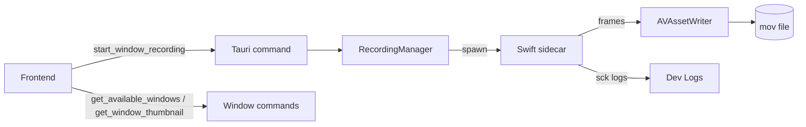

# Notari Screen Recording System

This document explains how window listing, thumbnails, and screen recording work on macOS (primary), and how the Swift ScreenCaptureKit sidecar is built and invoked from the Tauri backend.

## Overview
- Frontend (React): window picker, start/stop controls, and a simple error surface.
- Tauri backend (Rust):
  - Window listing and thumbnails
  - Recording orchestration and session state
  - Spawns a Swift sidecar that uses ScreenCaptureKit (SCK)
- Swift sidecar (SCKRecorder.swift):
  - Captures frames for a specific window using ScreenCaptureKit
  - Encodes them with AVAssetWriter into a .mov file
  - Writes logs to stderr, read by the Rust backend and surfaced in Dev Logs

## Architecture diagram

## Permissions (macOS)

Commands:

- `check_recording_permission() -> PermissionStatus`
- `request_recording_permission() -> bool`
- `open_system_settings() -> ()` (opens System Settings → Privacy & Security → Screen Recording)

Behavior:

- macOS requires the app to be granted “Screen Recording” permission.
- If recording fails to start due to permissions, the UI offers a one-click action to open system settings.

## Window Listing and Thumbnails

Tauri commands:

- `get_available_windows() -> Vec<WindowInfo>`
- `get_window_thumbnail(window_id: String) -> Option<String /* base64 */>`

Types:

- `WindowInfo { id, title, application, is_minimized, bounds, thumbnail? }`
- `WindowBounds { x, y, width, height }`

Platform notes:

- macOS: Enumerates windows and parses Notari’s own CoreGraphics window IDs (e.g. `cg_<number>`). Thumbnails are produced via a small helper that captures a still image for the specific window. Return is base64 PNG when available.
- Windows/Linux: Implementations exist with partial or placeholder thumbnail logic (focus is macOS for now).

## Recording Flow

Primary Tauri commands:

- `start_window_recording(window_id: String, preferences?: RecordingPreferences) -> ActiveRecording`
- `stop_recording(session_id: String) -> ()`
- `get_recording_info(session_id: String) -> RecordingInfo`
- `check_recording_health() -> ()`
- `get_active_recording_session() -> Option<ActiveRecording>`

Key types:

- `RecordingPreferences { save_directory?: PathBuf, filename_pattern: String, include_audio: bool, video_quality: VideoQuality }`
- `ActiveRecording { session_id, window_id, start_time, output_path, status, preferences }`
- `RecordingStatus = Preparing | Recording | Paused | Stopping | Stopped | Error(String)`
- `RecordingInfo { session: ActiveRecording, duration_seconds, file_size_bytes?, estimated_final_size_bytes? }`

Output path:

- Default directory: `~/Movies/Notari` (created if missing)
- Filename pattern supports `{timestamp}`
- Output container is `.mov`

## Swift Sidecar (ScreenCaptureKit)

Location:

- Swift code: `src-tauri/macos/SCKRecorder.swift`
- Built binary: `src-tauri/bin/sck-recorder-<target_triple>` during `cargo build` via build.rs

Build pipeline:

- `src-tauri/build.rs` invokes `swiftc` with:
  - `-target arm64-apple-macosx12.3`
  - Frameworks: ScreenCaptureKit, AVFoundation, CoreMedia, CoreVideo
  - Output to `src-tauri/bin/sck-recorder-<triple>`
- `tauri.conf.json` includes `"externalBin": ["bin/sck-recorder"]` so Tauri bundles the correct binary per platform/arch.

Runtime resolution:

- In release: we first look next to the app binary (Contents/MacOS/sck-recorder).
- In dev: we look under `src-tauri/bin/` (unsuffixed or suffixed path depending on build config).

How it works:

- Sidecar takes two args: `<cg_window_id> <output_path>`
- Initializes SCK to capture the selected window into an SCStream
- Defers AVAssetWriter creation until the first frame to bind exact pixel size
- Duplicates the last pixel buffer when idle samples arrive without an image to keep PTS advancing (prevents 0-duration movies on idle)
- Starts capture, blocks on stdin; Rust closes stdin to signal stop
- Finishes AVAssetWriter cleanly before exit
- Logs (stderr) are prefixed with `[sck]` and forwarded to Dev Logs

## Logging

- Backend logger categories of note: `backend`, `recording_manager`, `recording_commands`
- Sidecar logs (stderr/stdout) are forwarded into `backend` so they appear in Dev Logs UI.
- Example sidecar log lines:
  - `[sck] init windowId=... output=...`
  - `[sck] startCapture ok`
  - `[sck] writer initialized at first frame ...`
  - `[sck] sample buffer missing image buffer` (idle duplication path)

## Error Handling & UX

- If the sidecar fails to spawn, `start_window_recording` returns `Err("Failed to spawn SCK sidecar: ...")`.
- The frontend stays on the Window Picker and shows an inline error banner with:
  - The error text
  - A button to open macOS Screen Recording settings
  - Dismiss button

Common causes:

- Missing screen recording permission → open settings and grant; restart the app if required.
- Output directory not writable → change save folder in Settings.
- Window ID changed (window closed or recreated) → re-select the window.

## Development & Build

Requirements:

- macOS 12.3+
- Xcode command line tools (swiftc)

Typical workflows:

- Dev: `pnpm tauri dev` (runs frontend and Tauri)
- Build: `pnpm tauri build`

Artifacts:

- The SCK sidecar is generated as part of the build, not committed to git.
- `.gitignore` excludes `/src-tauri/target` and `/src-tauri/bin/sck-recorder*`.

## Tauri Command Reference (macOS focus)

- Window management:
  - `get_available_windows() -> Vec<WindowInfo>`
  - `get_window_thumbnail(window_id: String) -> Option<String>`
- Permissions:
  - `check_recording_permission() -> PermissionStatus`
  - `request_recording_permission() -> bool`
  - `open_system_settings() -> ()`
- Recording:
  - `start_window_recording(window_id: String, preferences?: RecordingPreferences) -> ActiveRecording`
  - `stop_recording(session_id: String) -> ()`
  - `get_recording_info(session_id: String) -> RecordingInfo`
  - `check_recording_health() -> ()`
  - `get_active_recording_session() -> Option<ActiveRecording>`

## Assumptions & Limitations

- Primary target is macOS with ScreenCaptureKit; Windows/Linux code paths are stubs/partial for listing and thumbnails.
- Audio capture is not enabled in the sidecar (include_audio is reserved for future work).
- Idle-frame duplication is implemented; optional timer-based ticks (when SCK stops callbacks entirely) are possible behind a setting if needed.

## Troubleshooting

- "Recording starts but duration is 0 unless I move the window": expected SCK behavior on idle; we duplicate last frame to advance PTS. If duration still doesn’t grow, collect `[sck]` logs around first frames and writer initialization.
- "Failed to spawn SCK sidecar": ensure permissions granted; confirm `swiftc` exists; check Dev Logs for the precise error.
- "No windows listed" or wrong window IDs: ensure the Window Picker is using the macOS list (ids like `cg_<number>`). Re-open the picker after creating the target window.
- "No thumbnail": thumbnails are best-effort; macOS path uses a helper; if missing, selection still works.

